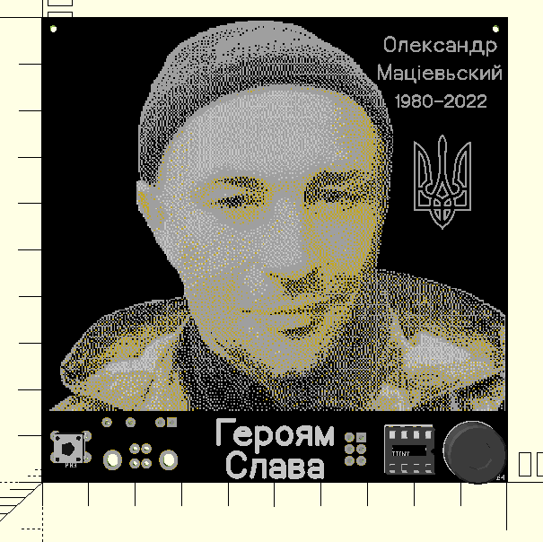
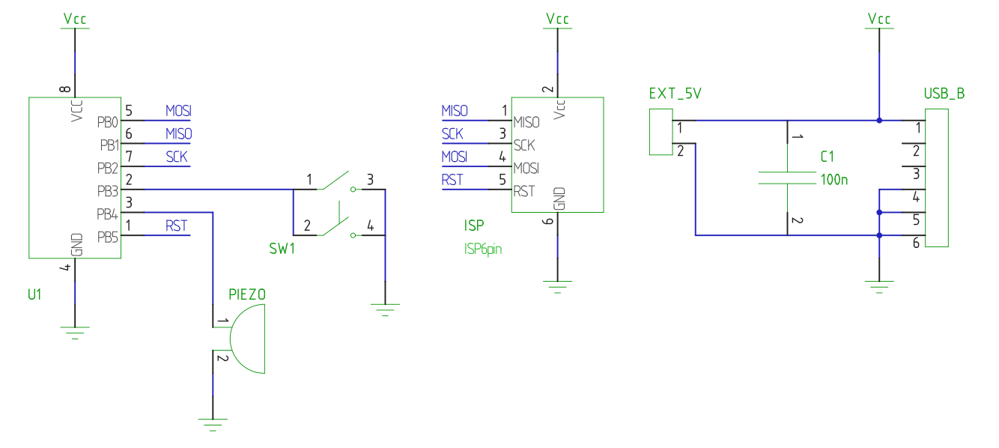

# STEM4ukraine-Oleksandr-Matsievskyi

A project to memorialise Oleksandr Matsievski, a Hero of Ukraine.

A school STEM project demonstrating through hole soldering and digital electronics using USB to power the circuit.

The Ukrainian national anthem is played when the button is pressed.

The prototype is currently undergoing manufacturing and testing

An openscad render of the front of the PCB:

The circuit schematic; simplicity itself:

